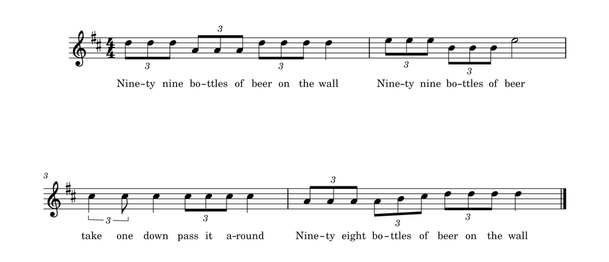

# C# Basic Assignment 3 - 99 Bottles of Beer

"99 Bottles of Beer" is a song dating to the mid-20th century. It is a traditional
reverse counting song in both the United States and Canada. It is popular to sing on
road trips, as it has a very repetitive format which is easy to memorize and can take a
long time when families sing. In particular, the song is often sung by children on long
school bus trips, such as class field trips, or on Scout or Girl Guide outings.



```
99 bottles of beer on the wall, 99 bottles of beer.
	Take one down and pass it around, 98 bottles of beer on the wall.

98 bottles of beer on the wall, 98 bottles of beer.
	Take one down and pass it around, 97 bottles of beer on the wall.

… and so on al the way down to …

2 bottles of beer on the wall, 2 bottles of beer.
	Take one down and pass it around, 1 bottle of beer on the wall.

1 bottle of beer on the wall, 1 bottle of beer.
	Take one down and pass it around, no more bottles of beer on the wall.

No more bottles of beer on the wall, no more bottles of beer.
	Go to the store and buy some more, 99 bottles of beer on the wall.
```

## Requirements
- Write a program that prints all 100 verses (it is possible to start over again with
the new 99 bottles you just bought but lets skip that possibility to save you
liver and wallet the pain).
- Have the two last verses use singular form for bottles and the text no more
bottles instead of 1 bottles and 0 bottles.

## Optionals
- Write the numbers in plain text instead of numerical values (Ninety nine
instead of 99 and so on)
- Play the music while it prints the verses. [Link to music on wiki](https://en.wikipedia.org/wiki/99_Bottles_of_Beer)
